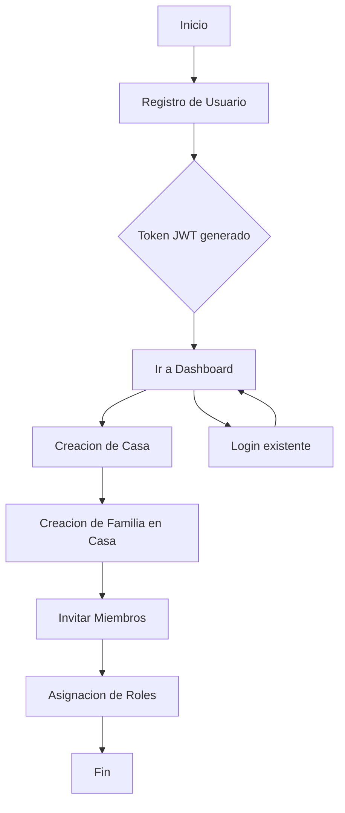
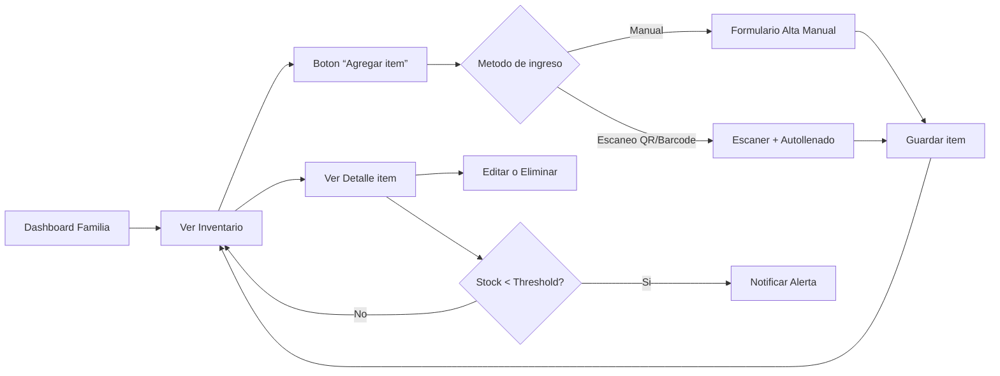
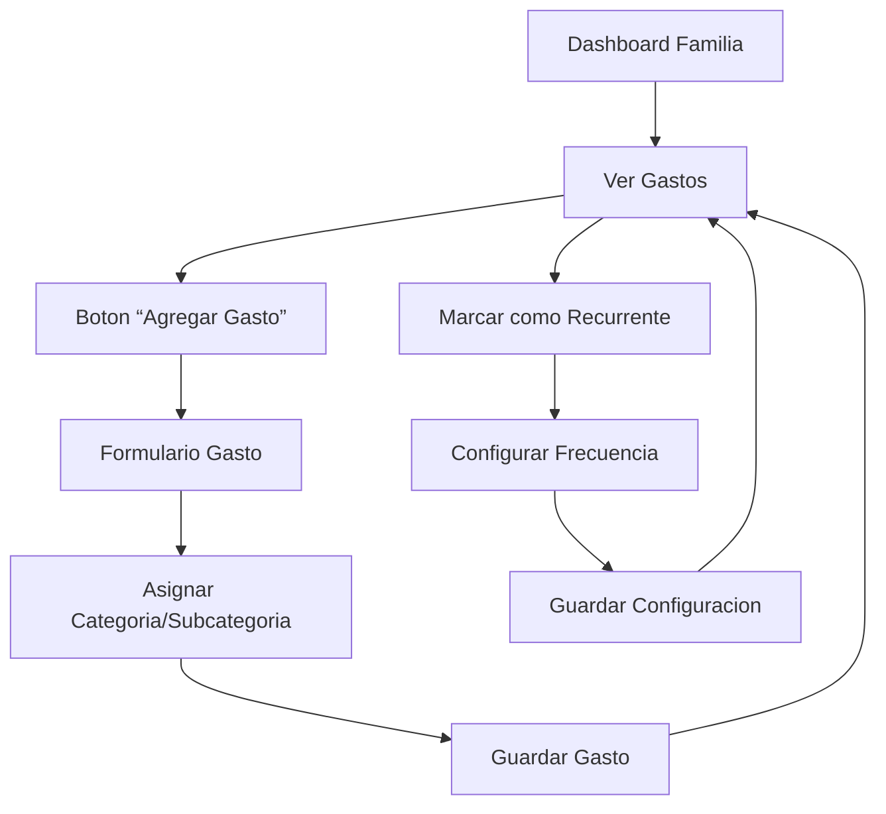
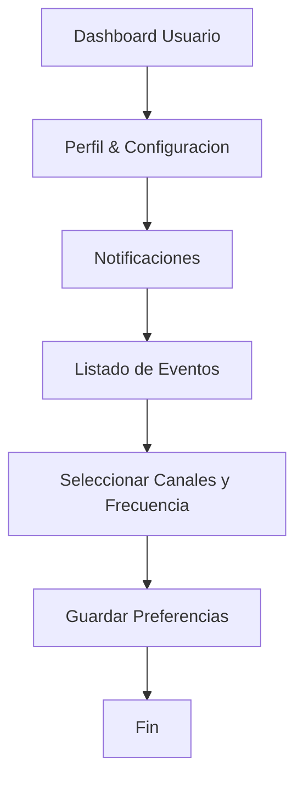
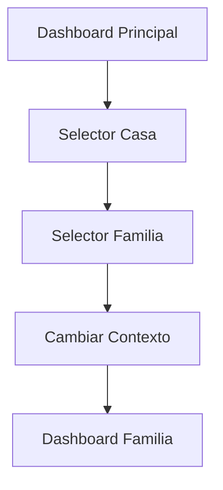

# Documentacion de la Aplicacion “MiHogarIA”

Una vision general orientada a usuarios y colaboradores, con los principales flujos y pantallas de la app para gestion de casas, familias, inventario, gastos, reportes y notificaciones.

---

## indice de Flujos

1. [Autenticacion y Gestion de Familias](#1-autenticacion-y-gestion-de-familias)
2. [Gestion de Inventario](#2-gestion-de-inventario)
3. [Registro de Gastos y Gastos Recurrentes](#3-registro-de-gastos-y-gastos-recurrentes)
4. [Reportes y Forecast](#4-reportes-y-forecast)
5. [Configuracion de Notificaciones](#5-configuracion-de-notificaciones)
6. [Cambio de Contexto (Casa / Familia)](#6-cambio-de-contexto-casa--familia)

---

## 1. Autenticacion y Gestion de Familias

**Objetivo**: Registrar y autenticar usuarios, crear casas y familias, y gestionar roles de los miembros.



**Pantallas UX/UI**

1. **Registro / Login**
2. **Dashboard Inicial** (seleccion o creacion de Casa/Familia)
3. **Crear Casa** (nombre, direccion)
4. **Administrar Familias** (lista, crear)
5. **Gestionar Miembros** (invitar por email, asignar rol)

---

## 2. Gestion de Inventario

**Objetivo**: Dar de alta, editar y visualizar items del hogar, con alertas de stock bajo.



**Pantallas UX/UI**

1. **Inventario** (lista, busqueda, filtros)
2. **Alta de item** (manual o escaneo)
3. **Detalle de item** (historial, threshold)
4. **Edicion de item**
5. **Alerta de Stock Bajo**

---

## 3. Registro de Gastos y Gastos Recurrentes

**Objetivo**: Registrar gastos puntuales y recurrentes, y mantenerlos organizados por categorias y fechas.



**Pantallas UX/UI**

1. **Listado de Gastos** (filtros por categoria, fecha)
2. **Formulario de Gasto** (monto, fecha, categoria, descripcion)
3. **Detalle de Gasto** (ver/editar/eliminar)
4. **Configurar Gasto Recurrente** (frecuencia, proxima fecha)
5. **Calendario de Vencimientos**

---

## 4. Reportes y Forecast

**Objetivo**: Ofrecer resumenes de ingresos/egresos y proyecciones de gastos futuras.

```mermaid
flowchart LR
  A[Dashboard Familia] --> B[Seccion Reportes]
  B --> C[Resumen Periodo]
  C --> D[Seleccionar Fechas]
  D --> E[Mostrar Graficos (Ingresos/Egresos)]
  B --> F[Forecast]
  F --> G[Elegir Horizonte]
  G --> H[Generar Proyeccion]
  H --> I[Ver Resultados]
```

**Pantallas UX/UI**

1. **Resumen de Periodo** (graficos de barras, pastel, lineas)
2. **Forecast** (selector de horizonte, grafico de proyeccion)
3. **Exportar Informe** (PDF, Excel)

---

## 5. Configuracion de Notificaciones

**Objetivo**: Permitir al usuario elegir para que eventos desea recibir alertas y por que canales.



**Pantallas UX/UI**

1. **Perfil de Usuario**
2. **Configuracion de Notificaciones** (checkbox por evento, canal y frecuencia)

---

## 6. Cambio de Contexto (Casa / Familia)

**Objetivo**: Facilitar al usuario el cambio rapido entre diferentes casas y familias.



**Pantallas UX/UI**

1. **Selector de Casa/Familia** (dropdown o modal)
2. **Indicador de Contexto Actual** (barra superior mostrando Casa > Familia)

