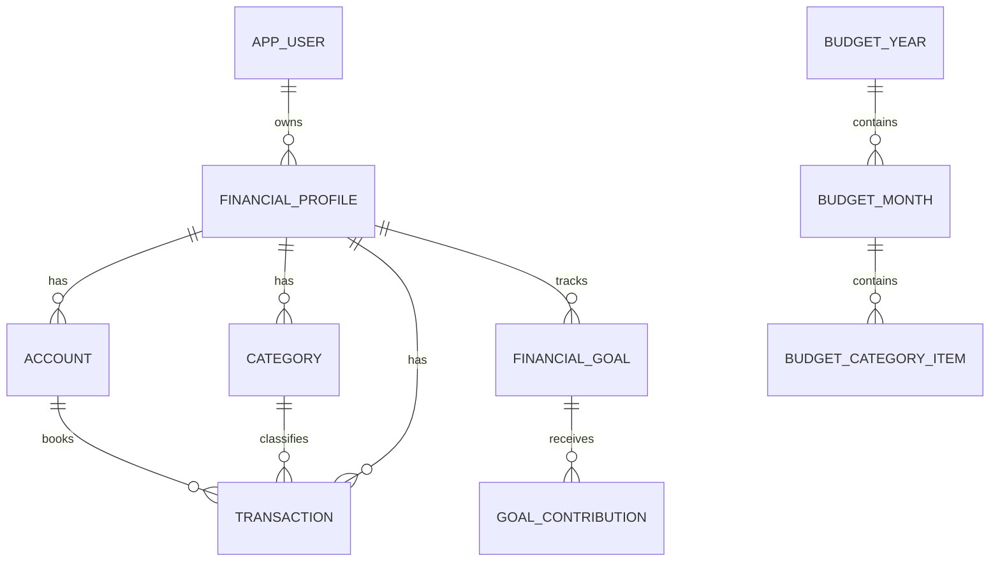
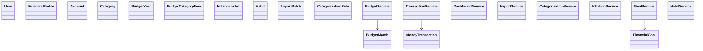

# HogarIA

Proyecto base fullstack para presupuesto personal/familiar/negocio.

## Resumen ejecutivo
- Reemplaza Excel anual con flujo guiado de 8 pasos.
- Sirve a personas, familias y pequeños negocios.
- Automatiza balance mensual/anual, regla 50-30-20, comparación budget vs real, proyección por inflación y alertas.
- MVP deja manual: carga inicial de categorías, configuración de reglas y carga manual de inflación si no hay integración.

## Arquitectura general
- Backend: Java 21 + Spring Boot + JPA + Flyway + Security JWT-ready + OpenAPI.
- Frontend: React + TypeScript + Vite + React Router + TanStack Query + RHF + Zod + Tailwind + Recharts.
- DB: PostgreSQL 16+, UUID PK, NUMERIC(19,2) para dinero.
- Integraciones: inflación (INDEC/datos.gob.ar/BCRA REM) en modo manual + conector futuro.
- Importador: CSV/XLSX con preview, deduplicación y reglas por keyword.
- Observabilidad: logs estructurados, audit_log, health check.

## Estructura
- `backend/` API y lógica de negocio.
- `frontend/` SPA.
- `backend/src/main/resources/db/migration/V1__init.sql` esquema base.

## ER (Mermaid)


## Class diagram


## API REST (mínima)
- `/api/auth`
- `/api/profiles`
- `/api/categories`
- `/api/accounts`
- `/api/transactions`
- `/api/budgets`
- `/api/dashboard`
- `/api/goals`
- `/api/inflation`
- `/api/habits`
- `/api/imports`
- `/api/categorization-rules`

## Fórmulas
- `balance_mensual = ingresos - gastos - ahorro`
- `gastos_totales = gastos_fijos + gastos_variables`
- `inflacion_acumulada = Π(1 + inflacion_mensual) - 1`
- `aporte_mensual_objetivo = (monto_objetivo - monto_actual) / meses_restantes`
- `meses_fondo = fondo / promedio_gastos`

## Seguridad
- JWT Bearer + BCrypt.
- Filtrado estricto por `user_id`/`profile_id`.
- Validación de ownership en services.
- CORS por whitelist.
- No loguear credenciales.

## Variables de entorno
- `DB_URL`, `DB_USER`, `DB_PASSWORD`, `JWT_SECRET`

## Ejecutar
```bash
docker compose up -d
cd backend && mvn spring-boot:run
cd frontend && npm install && npm run dev
```

## Roadmap
- MVP: CRUD categorías/cuentas, movimientos manuales, presupuesto mensual, dashboard, objetivos, hábitos, import CSV.
- V2: XLSX avanzado, reglas inteligentes, OCR opcional, APIs oficiales de inflación, multimoneda, cuotas avanzadas.
- V3: app mobile, notificaciones, recomendaciones automáticas, predicción, conciliación avanzada.
